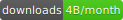
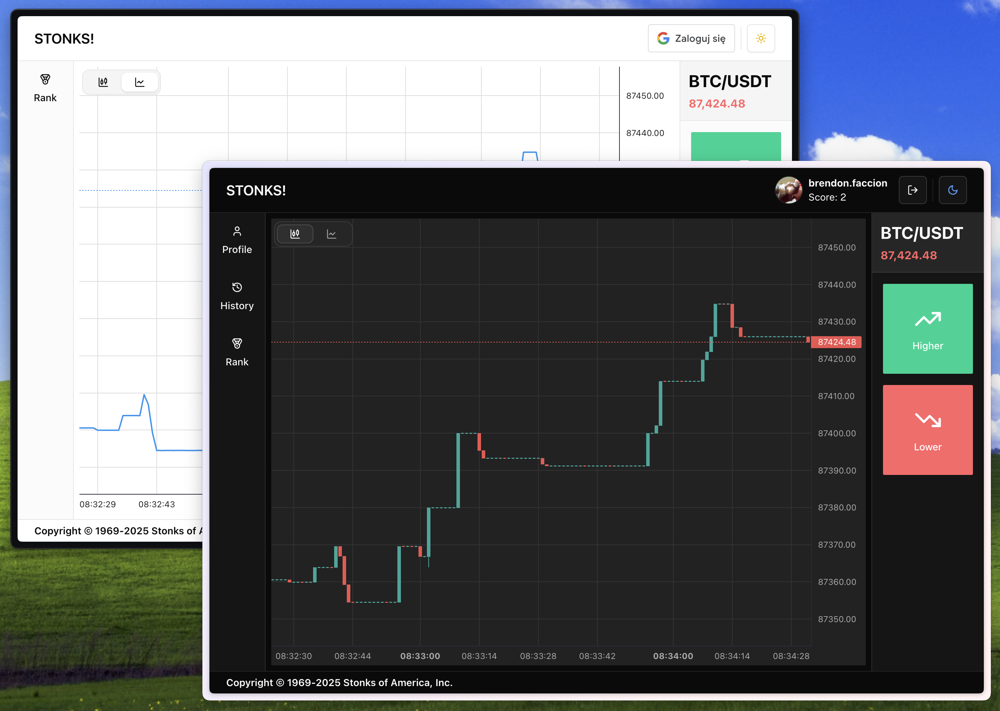
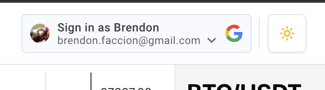
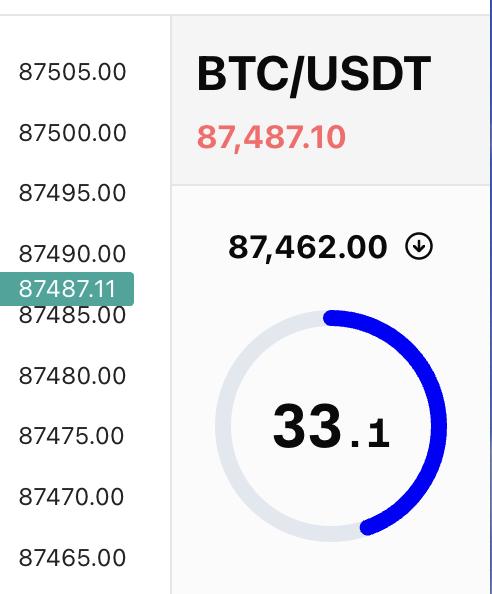
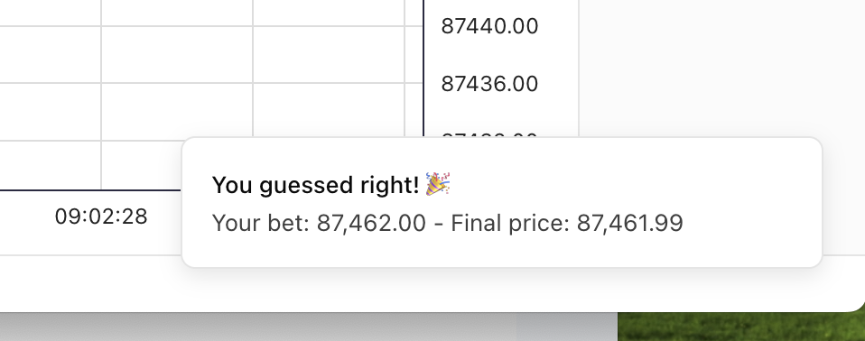

<h1 align="center">
<picture>
    
</picture> 

<br>





</h1>

<div align="center">

STONKS! is live at https://stonks-1-c1fb.onrender.com


<br>

<a href="#how-to-run">How to run</a>&nbsp;&nbsp;&nbsp;&nbsp;|&nbsp;&nbsp;&nbsp;&nbsp;<a href="#overview">Overview →</a>

</div>

---

## How to run

The project is a monorepo with `bun` as package manager and `docker` for the database.
Both should be available in order to run the project locally.

To setup the local environment:


```bash
git glone git@github.com:betafcc/stonks.git
cd stonks
bun install
```

Setup the database:

```bash
cd backend
cp .env.development .env
docker compose up -d
bun run db:push # sync the schema
```

Run frontend + backend:

```bash
cd .. # root folder
bun run dev
```

### Overview

<p align="center">
    
</p align="center"> 

Rules:
- The player can at all times see their current score and the latest available BTC price in USD ✅
- The player can choose to enter a guess of either “up” or “down“ ✅ * <sup><sup>('higher' or 'lower' looked better)</sup></sup>
- After a guess is entered, the player cannot make new guesses until the existing guess is resolved ✅
- The guess is resolved when the price changes and at least 60 seconds have passed since the guess was made ✅
- If the guess is correct (up = price went higher, down = price went lower), the user gets 1 point added to their score. If the guess is incorrect, the user loses 1 point. ✅
- Players can only make one guess at a time ✅
- New players start with a score of 0 ✅

Solution requirements:
- The guesses should be resolved fairly using BTC price data from any available 3rd party API
- The score of each player should be persisted in a backend data store (AWS services preferred)
- Please provide us a link to your deployed solution.
- Optional: Players should be able to close their browser and return back to see their score and continue to make more guesses


#### Login with google

For easy user management. One click and the user is playing with the score being tracked.

<p align="center">
    
</p align="center"> 


#### Live candlestick and line price chart

Although not listed as a requirement, it was a very obvious feature. If I saw a game like that without one, I'd click away

#### Bet Timer

<p align="center">
    
</p align="center"> 


#### Bet result notification

<p align="center">
    
</p align="center">


### Architecture overview

The Stack used:

- NextJS static export SPA frontend
- Shadcn UI
- tRPC server
- Postgres database
- Binance API

The main files to understand the logic of the app are:

- [backend/service.ts](backend/service.ts) - all the backend business logic
- [backend/db/schema.ts](backend/db/schema.ts) - the schema, defining `users` and `bets` models
- [frontend/hooks/app.ts](frontend/hooks/app.ts) - the whole logic of the frontend <sup>1</sup>, in a more-or-less redux style (is more based on a 'TEA' and a bit cqrs/es inspired architecture)

<sup>1</sup> To avoid some annoying re-rendering bugs encountered, a small part of the functionality had to be handled by the `Timer` component instead

While AWS was suggested for deployment, quite late in development I encountered problems running tRPC on lambda, so had to fallback to a simpler setup with Render instead.

Still the project was built with a serverless AWS-y architecture in mind:

#### 1. Users follow the price directly, with binance api streaming to the front end

relevant:
- [common/binance.ts](common/binance.ts) - lower level binance api
- [frontend/hooks/react-binance.ts](frontend/hooks/react-binance.ts) - react hooks for following live price and feeding the chart - Note that the definition of "current price" is tied to the `aggTrades` stream, since it's the only one on Binance that allows for both live and historic fetching

- [frontend/components/ui/live-chart.tsx]([frontend/components/ui/live-chart.tsx]) - the live chart implementation using 'lightweight-charts'
- [frontend/components/ui/live-ticker.tsx](frontend/components/ui/live-ticker.tsx) - live ticker showing the price with max time resolution

#### 2. Users request a bet to the server with only `{ symbol, direction, userTimestamp }`

relevant:
- [frontend/hooks/app.ts#L123](frontend/hooks/app.ts#L123) - the `createBet` action is as simple and stateless as it gets
- [backend/service.ts#L96](backend/service.ts#L96) - the server takes that payload and fetches the price, saves to `bets` table and send back an unfulfilled bet object to the client

#### 3. After some time passed, the client asks the server to fulfill the bet

Although I initially had some "push update" functionality in mind, it wasn't really needed, as the server has the info to be fair by checking the previously created bet object for the time it has to compare against when the user asks for a result.

The client can simply have a timeout to request, or close the window and come back later - the init routines will check for unfulfilled bet on the user relation.

relevant:
- [frontend/hooks/app.ts#L135](frontend/hooks/app.ts#L135) - frontend request of the result
- [backend/service.ts#129](backend/service.ts#129) - server routine with the logic of wether or not the bet can be retrieved already, and fulfilling it if so
- [common/binance.ts#191](common/binance.ts#191) - `fetchFirstPriceChange({ symbol, timestamp, value })` is responsible for the required <i>"when the price changes and at least 60 seconds have passed since the guess was made"</i>
- [frontend/components/ui/timer.tsx](frontend/components/ui/timer.tsx) - the timer component with a `onTimetout` handler
- [frontend/hooks/app.ts#L181](frontend/hooks/app.ts#L181) - the init routine that is done when the app is loaded, to sync any unfufilled bet and resolve it


### Note on the original architecture

The original plan was to implement the following flow using aws services:

```
 ┌──────────────┐          ┌─────────────────┐
 │  Next.js App │   --->   │  API Gateway    │
 │ (frontend)   │  POST    │  /bet (Lambda)  │
 └──────────────┘          └─────────────────┘
                            |  1) store bet
                            |  2) push to SQS (60s delay)
                            v
                      ┌────────────────────┐
                      │  DynamoDB (bets,   │
                      │  user scores)      │
                      └────────────────────┘
                            ^
                            |  after 60s
                            |  “resolve bet”
                            │  (SQS triggered)
                            └─────────────────┐
                                              v
                                       ┌────────────┐
                                       │ ResolveBet │
                                       │   Lambda   │
                                       └────────────┘
```

The Frontend could then sync state with AWS API Gateway (using WebSocket APIs) or a more fancy solution with AWS AppSync (but would tie to GraphQL use).

Some elements of the original idea are still there, as the Nextjs generates a fully static SPA, and a [backend/lambda-server.ts](backend/lambda-server.ts) is provided too.
